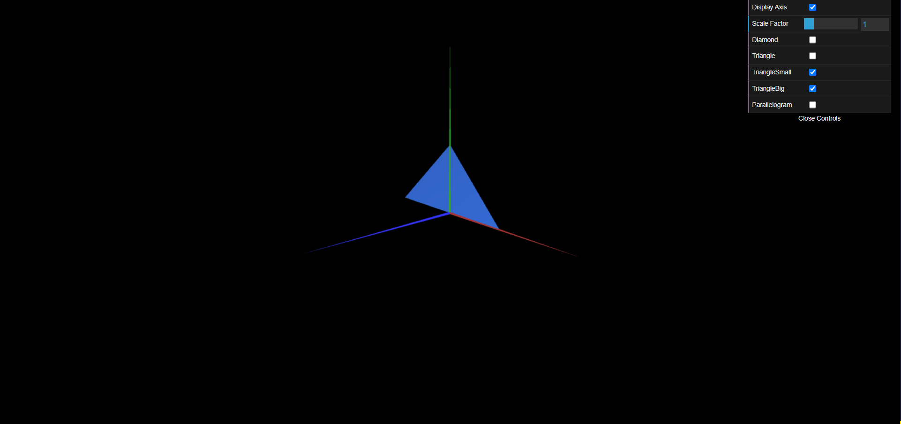

# CG 2023/2024

## Group T03G08

## TP 1 Notes

- In exercise 1 we observed that to create an object we need to create a class, add the vertices and the indexes following a counter-clock way. Then we initilize the object in MyScene and then display it. We add the checkboxes in MyInterface, and in MyScene we initialize the checkboxes variables and use them to display or not each object.
  
- In exercise 2 we applied the same logic as exercise 1.

