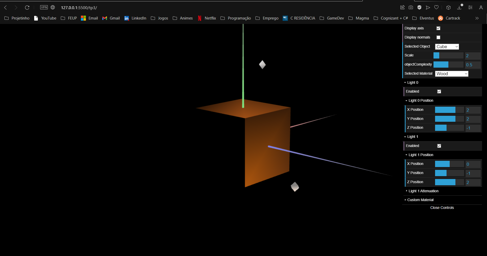
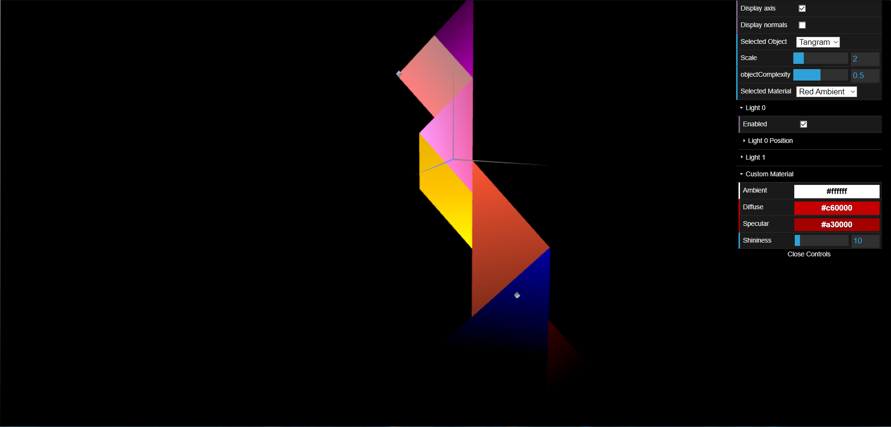
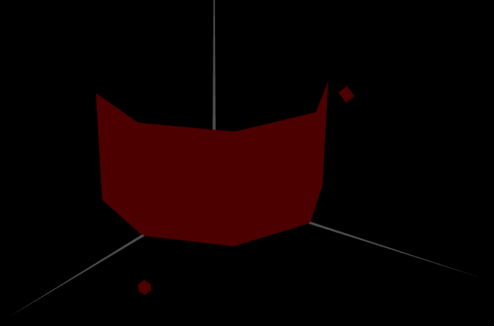
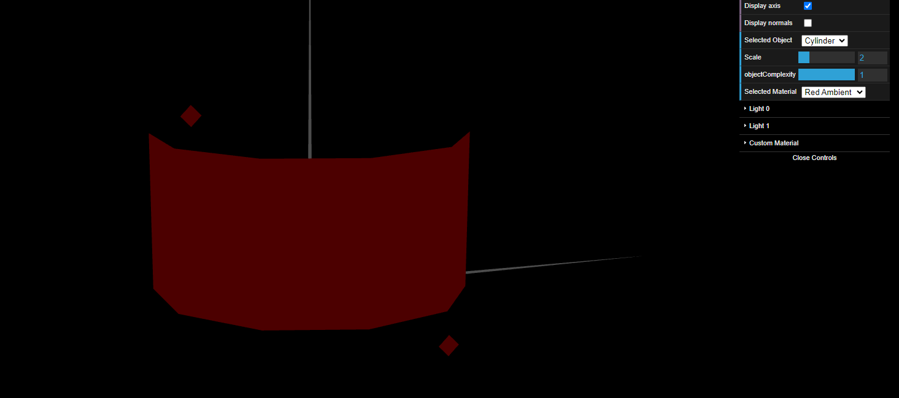

For the first exercise we used MyTangram and MyUnitCube and experimented forms of lighting in the materials. Then we declared the respective normals in initBuffers(). We created a material with the color similar to wood and tested it in the cube. For the tangram we created a material for each color increasing the specular component.

In exercise 2 we created the class MyPrism with a constructor where the parameters `slices` and `stacks` were declared. Using the for loop,it was possible to build the prism with a variable number of slides and stacks, where the normals of the vertices declared were perpendicular to the respective faces.

In exercise 3 we created the class MyCylinder with the similar structure of the prism. But this time, each vertex used on two adjacent sides have the same normal. With some alterations, the list of vertices and normals was simplified in order to eliminate all duplicates. That way, the lighting on the edges is smoothed, giving the desired curved appearance.

